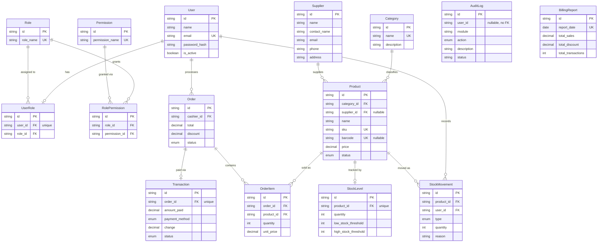

# AGORA Inventory & POS System — Database Schema

_Last verified: AGORA-171 to AGORA-174 (FK constraints, query performance, audit coverage, and data integrity all confirmed clean)._

## Entity Relationship Diagram

> `AuditLog` and `BillingReport` are intentionally not connected by foreign key to `User`/`Order` — they're append-only records that must survive deletion of the entities they describe, so `user_id` on `AuditLog` is stored as a plain nullable string, not a relation.

## Models

### User
Authentication and identity. A user's permissions come from their assigned `Role` via `UserRole`, not from a field on `User` itself.

| Field | Type | Notes |
|---|---|---|
| id | uuid | PK |
| email | string | unique |
| password_hash | string | bcrypt, 12 rounds |
| is_active | boolean | soft-disable flag; used instead of deletion once a user has order/stock history |

### Role / Permission / UserRole / RolePermission
RBAC layer. Four seeded roles: `SUPER_ADMIN`, `ADMIN`, `MANAGER`, `CASHIER`. Permissions are string codes (`product:create`, `order:refund`, etc.) mapped to roles via `RolePermission`. Cached in Redis per-role (`perms:{role}`, 5 min TTL) to avoid a DB round trip on every permission check.

**Cascade behavior:**
- `UserRole.user_id → User`: `Cascade` — deleting a user removes their role assignment
- `RolePermission.role_id / permission_id`: both `Cascade` — deleting a role or permission cleans up grants

### Category / Supplier
Simple reference tables for `Product`. `Category.name` and nothing on `Supplier` is unique, since supplier names aren't guaranteed unique in the real world (e.g. franchises).

**Cascade behavior:**
- `Product.supplier_id → Supplier`: `SetNull` — deleting a supplier un-links its products rather than deleting them
- `Product.category_id → Category`: default `Restrict` — a category can't be deleted while products reference it

### Product
Core catalog entity. Every product should have exactly one `StockLevel` row, created atomically alongside the product.

**Cascade behavior:**
- `StockLevel.product_id → Product`: `Cascade` — deleting a product removes its stock level
- `OrderItem.product_id → Product`: default `Restrict` — a product with sales history cannot be deleted
- `StockMovement.product_id → Product`: default `Restrict` — a product with stock movement history cannot be deleted

**Delete policy (enforced in `product.controller.ts`, not just at the DB level):** a product can only be hard-deleted if it has zero order items AND zero stock movements. Otherwise, set `status: INACTIVE` instead. This preserves audit trail and sales history even though the DB constraint alone would only block one of the two paths depending on deletion order.

### StockLevel
One row per product. `low_stock_threshold` and `high_stock_threshold` drive the alerting logic in `stockIn`/`stockOut` (Redis-deduplicated alerts, 24h suppression window per product).

### StockMovement
Append-only ledger of every stock change (`STOCK_IN`, `STOCK_OUT`, `ADJUSTMENT`), tied to the user who performed it. This is the audit trail for inventory — never deleted, only ever inserted.

### Order / OrderItem / Transaction
A sale. `Order` and its `OrderItem`s are created in a single Prisma transaction along with the `Transaction` (payment) record and the corresponding `StockMovement`/`StockLevel` decrements — all four writes succeed or none do.

**Cascade behavior:**
- `OrderItem.order_id → Order`: `Cascade` — deleting an order removes its line items
- `OrderItem.product_id → Product`: default `Restrict`
- `Transaction.order_id → Order`: explicit `Restrict` — an order with a recorded payment cannot be deleted

### AuditLog
Security/compliance trail. Written via `audit.middleware.ts`, wrapped around routes rather than called manually in each controller. Captures actor (`user_id`, `user_role`), IP, module, action, human-readable description, and success/failure status (derived from HTTP status code).

**Coverage as of AGORA-173:**

| Module | CREATE | UPDATE | DELETE | Other |
|---|---|---|---|---|
| Auth | — | — | — | LOGIN, LOGOUT |
| Product | ✅ | ✅ | ✅ | |
| Category | ✅ | ✅ | ✅ | |
| Supplier | ✅ | ✅ | ✅ | |
| Stock | ✅ (in/out) | — | — | |
| Order | ✅ | — | — | |
| Transaction | ✅ | — | — | |
| User | ✅ | ✅ | ✅ | ADJUST (status toggle) |

`VOID` and `EXPORT` are reserved enum values with no corresponding endpoint yet — not a gap, just unbuilt functionality (order cancellation/refund, data export).

### BillingReport
Daily aggregate snapshot (one row per `report_date`, enforced via `@@unique`). Populated separately from the per-transaction billing report endpoint (`GET /api/reports/billing`), which computes line-item detail on demand rather than reading from this table — `BillingReport` is for historical daily rollups, not the live detailed report.

## Indexes

| Table | Index | Purpose |
|---|---|---|
| Product | category_id, supplier_id | filter by category/supplier |
| StockMovement | product_id, user_id, created_at | filterable movement history |
| Order | cashier_id, status, created_at | filtered/paginated order lists |
| OrderItem | order_id, product_id | joins |
| Transaction | created_at | billing report date-range queries (AGORA-172) |
| AuditLog | user_id, module, action, created_at | filterable audit log queries |
| BillingReport | report_date | unique constraint + lookup |

## Data Integrity (AGORA-174, verified)

As of the last check, all of the following returned zero rows:
- Products with no `StockLevel`
- `StockLevel.quantity < 0`
- Orders with no `OrderItem`
- `COMPLETED` orders with no `Transaction`

Re-run before each release using the queries in `AGORA-174`.
